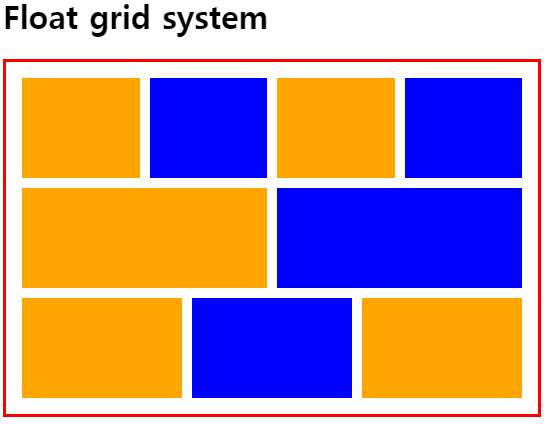
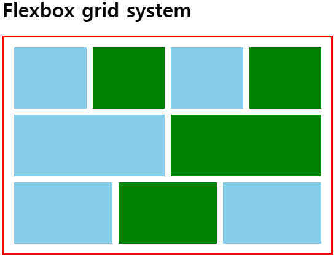
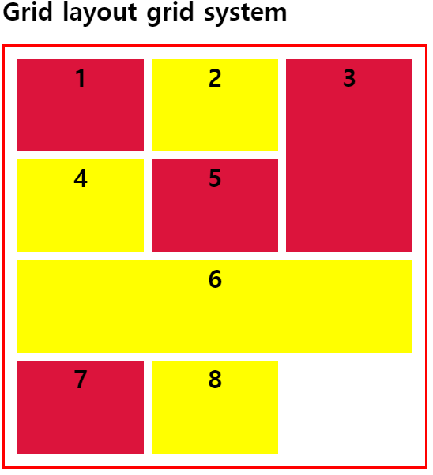

# Grid system

Grid layout を実装するために設計した System で、`width` 960px, 1200px を基準にして列(Column)の個数によって 12 段/16 段/24 段 Grid などがある。一般的には 12 段 Grid が使われる。

<br>

## Float grid system

flexbox や grid の前に使われる方法で`float` 属性を使い実装する。float の`height`に関して `clearfix`を使わないといけない、また各サイズを計算し、表記しないといけない



```html
<h1>Float grid system</h1>
<div class="container">
    <div class="row">
        <div class="col col-3-12"></div>
        <div class="col col-3-12"></div>
        <div class="col col-3-12"></div>
        <div class="col col-3-12"></div>
    </div>
    <div class="row">
        <div class="col col-6-12"></div>
        <div class="col col-6-12"></div>
    </div>
    <div class="row">
        <div class="col col-4-12"></div>
        <div class="col col-4-12"></div>
        <div class="col col-4-12"></div>
    </div>
</div>
```

```css
:root {
    --gutter: 10px;
}
.container {
    width: 500px;
    border: 3px solid red;
    padding: 1rem;
}
.row::after {
    content: '';
    display: block;
    clear: both;
}

.row + .row {
    margin-top: var(--gutter);
}

.col {
    height: 100px;
    background-color: orange;
    float: left;
    margin-right: var(--gutter);
}

.col:last-child {
    margin-right: 0;
}

.col-1-12 { width: calc(100%/(12/1) - var(--gutter)*11/12); }
.col-2-12 { width: calc(100%/(12/2) - var(--gutter)*10/12); }
.col-3-12 { width: calc(100%/(12/3) - var(--gutter)*9/12); }
.col-4-12 { width: calc(100%/(12/4) - var(--gutter)*8/12); }
.col-5-12 { width: calc(100%/(12/5) - var(--gutter)*7/12); }
.col-6-12 { width: calc(100%/(12/6) - var(--gutter)*6/12); }
.col-7-12 { width: calc(100%/(12/7) - var(--gutter)*5/12); }
.col-8-12 { width: calc(100%/(12/8) - var(--gutter)*4/12); }
.col-9-12 { width: calc(100%/(12/9) - var(--gutter)*3/12); }
.col-10-12 { width: calc(100%/(12/10) - var(--gutter)*2/12); }
.col-11-12 { width: calc(100%/(12/11) - var(--gutter)*1/12); }
.col-12-12 { width: calc(100%/(12/12) - var(--gutter)*0/12); }

.col:nth-child(even) {
    background-color: blue;
}
```

`row::after` で clearfix を適用し、 行の `margin` で 縦の間隔を, 列の `margin` で横の間隔を指定した。また 12 段 Grid であるため `.col-x-12` が意味するのは 12 段の中 x 個を示す幅を意味する。 間隔にレスポンシブに適用するため`--gutter` 変数を作成した。

<br>

## Flexbox grid system



`float`と似たような感じではあるが、clearfix がない。

```css
/*.row::after {
  content: '';
  display: block;
  clear: both;
}*/
.row {
    display: flex;
}
```

<br>

## Grid layout grid system

grid は float/flexbox とは完全に違う。幅の計算や `row` 나 `column` などを特定することもない。単純に grid property を使い縦/横の幅およびサイズ、割合を指定する。



```html
<h1>Grid layout grid system</h1>
<div class="container">
    <div class="grid">
        <div class="item item-1">1</div>
        <div class="item item-2">2</div>
        <div class="item item-3">3</div>
        <div class="item item-4">4</div>
        <div class="item item-5">5</div>
        <div class="item item-6">6</div>
        <div class="item item-7">7</div>
        <div class="item item-8">8</div>
    </div>
</div>
```

```css
.container {
    width: 500px;
    border: 3px solid red;
    padding: 1rem;
}

.grid {
    display: grid;
    height: 500px;
    grid-template-rows: repeat(4, 1fr);
    grid-template-columns: repeat(3, 1fr);
    grid-row-gap: 10px;
    grid-column-gap: 10px;
}

.item {
    background-color: crimson;
    text-align: center;
    font-size: 2rem;
    font-weight: bold;
}

.item:nth-child(even) {
    background-color: yellow;
}

.item-3 {
    grid-row: 1/3;
    grid-column-start: 3;
}

.item-6 {
    grid-column: 1/4;
    grid-row: 3/4;
}
```

<br>
