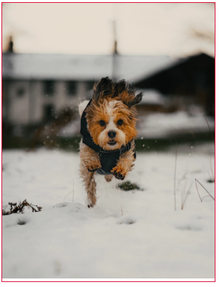
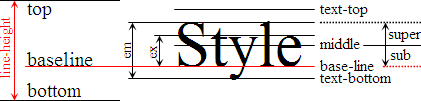

# img の下の空白

## img の下の空白

`` タグは基本的に下に空白を生成する。

```html
<div class="container">
    
</div>
```

```css
.container {
    width: 300px;
    border: 1px solid crimson;
}

img {
    max-width: 100%;
}
```

<p align="center">
	
</p>

<br>

## 空白ができる理由

`` タグは Inline-level 要素であり、一般テキストのように baseline 基準に整列される。これは`vertical-align: baseline`が Default とのことである。

<p align="center">
	
</p>

[Image from](https://stackoverflow.com/a/34952703/11789111)

上の画像からテキストが Baseline を基準に整列されたことがわかる。``もそのようになっているため、y, j, p, g, q のような descender 文字のためにしたに空間ができる。

<br>

## 解決

⚠ `` に `display: block` : Block-level 要素に変える。一行を全部占めることになる。

⚠ 親要素に `line-height: 0` : 子要素の `line-height`をなくす方法で、テキストにも影響があるため、いい方法ではない。

✅ **`` に `vertical-align: middle/top/bottom`** : `vertical-align` を変える方法で、根本的な解決だといえる。

<br>

## Reference

-   [Image inside div has extra space below the image](https://stackoverflow.com/questions/5804256/image-inside-div-has-extra-space-below-the-image)
