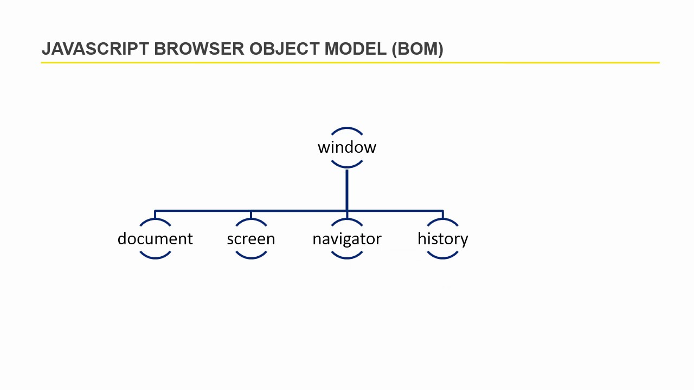
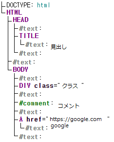

# BOM と DOM

## BOM (Browser Object Model)

BOM は**Browser の枠、フレームをプログラミング的に Control できるようにしてくれる Object Model**。BOM を通して Browser の新しいタブを開いたり、他の Page に移動したりなどの機能を実装できる。 Global object として `window`があり、 その下に `location` , `navigator` , `document` , `screen` , `history`が含まれている。



[Image from](https://i.ytimg.com/vi/TvLjhVVFClA/maxresdefault.jpg)
<br>

## DOM (Document Object Model)

**Web Page をプログラミング的に Control できるようにしてくれる Object Model**。 最上位 Interface として Node があり、これは下記のような構造となっている。


[Image from](https://web.stanford.edu/class/cs98si/slides/the-document-object-model.html)

上の Tree structure を見ると Element を含めて Text、Comment まで DOM Tree に含まれていることがわかる。実際に DOM Tree は下記のように生成される。

HTML

```html
<!DOCTYPE html>
<html>
    <head>
        <title>見出し</title>
    </head>
    <body>
        <div class="クラス"></div>
        <!-- コメント -->
        <a href="https://google.com">google</a>
    </body>
</html>
```

DOM Tree



上は[Live DOM Viewer](https://software.hixie.ch/utilities/js/live-dom-viewer/) を利用して DOM Tree を実現したもの。Element 以外にも Text、Comment まで Node に含まれていることがわかる。この DOM を Control するためには `getElementsById` , `querySelector` , `firstElementChild` など Browser が提供する DOM API を使う必要がある。

<br>

## Reference

-   [Stackoverflow, What is the DOM and BOM in JavaScript?](https://stackoverflow.com/questions/4416317/what-is-the-dom-and-bom-in-javascript)
