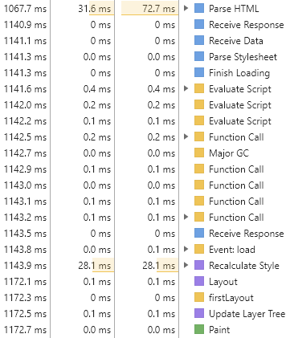

# Browser の Rendering の原理

Browser が画面に現れる要素を Rendering する時は Webkit、Gecko など**Rendering Engine**を使用する。
Rendering Engine が HTML、CSS、Javascript を Rendering する時は**CRP(Critical Rendering Path)**という Process を使用し、これは下記の 6 段階で整理できる。

1. **HTML Parsing の後、DOM(Document Object Model) Tree 構築**
2. **CSS Parcing の後, CSSOM(CSS Object Model) TREE 構築**
3. **Javascript 実行**
    - ⚠ HTML の途中で Javascript に出会うと HTML Parsing を見合わせる。
4. **DOM と CSSOM を 合わせて Render Tree 構築**
    - ⚠ `display: none` Property のように画面に見えない、またはサイズがない要素は Render Tree に構築されない。
5. **Viewport を基盤に Render Tree の各 Node が持つ正確な位置とサイズを計算(Layout / Reflow)**
6. **計算の後、位置、サイズを基盤に画面に描く(Paint)**

<br>

実際に Chrome Dev tool を使用し、下記の Code の Rendering を分析する。

HTML

```html
<!DOCTYPE html>
<html lang="en">
    <head>
        <meta charset="UTF-8" />
        <meta name="viewport" content="width=device-width, initial-scale=1.0" />
        <link rel="stylesheet" href="style.css" />
        <title>テスト</title>
    </head>
    <body>
        <div></div>
        <script src="script.js"></script>
    </body>
</html>
```

CSS

```css
body {
    background-color: red;
}
div {
    width: 100px;
    height: 100px;
    background-color: blue;
}
```

Javascript

```javascript
document.querySelector('div').addEventListener('click', () => {
    console.log('Click div')
})
```



上記の Log のように CRP の過程が行われる。

1. Parse HTML => HTML Parsing の後、 DOM Tree 構築
2. Parse Stylesheet => CSS Parsing の後, CSSOM Tree 構築
3. Evaluate Script => Javascript 実行
4. Render Tree 構築
5. Layout => Viewport を基盤に Render Tree の各 Node が持つ正確な位置とサイズを計算(Layout / Reflow)
6. Paint => Layout で計算した値を画面に描く

<br>

## Reference

-   [MDN, Critical Rendering Path](https://developer.mozilla.org/en-US/docs/Web/Performance/Critical_rendering_path)
-   [Stackoverflow, When does parsing HTML DOM tree happen?](https://stackoverflow.com/questions/34269416/when-does-parsing-html-dom-tree-happen)
