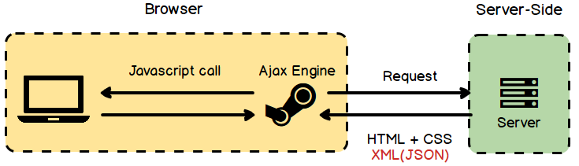

# AJAX

## AJAX とは?

Asynchronous Javascript And XML の略で、Javascript を使用し、**非同期的に Data をもらい、動的に DOM を更新、操作すること**を示す。XML は今は JSON により代替された昔の Data format である。

<br>

## AJAX の原理



User が AJAX が適用された UI と Interaction すると、Server に Ajax Request が送られて来る。Server は DB から Data を持ち出し、Javascript に指示され HTML,CSS で作られた DOM を Update する。非同期処理でありながら、Page を全部 Loading するのではなく、**一部分だけ Update する方式である。**

<br>

## Ajax の実装

### XMLHttpRequest

一般的に `XMLHttpRequest` Object を使用し、Instance を作る。そして `open()` , `send()` などの Method を使い通信を行う。

```javascript
var ourRequest = new XMLHttpRequest()
ourRequest.open(
    'GET',
    'https://learnwebcode.github.io/json-example/animals-1.json'
)
ourRequest.onload = () => {
    var ourData = JSON.parse(ourRequest.responseText)
    console.log(ourData[0])
}
ourRequest.send()
```

`open()` で Request を定義し Loading が終わったら実行する Callback を初期化する形となっている。

### Fetch API

より最新の `fetch`がある。ただし IE を支援してない弱点はあるが、`XMLHttpReqeust` より遥か直感的で便利である。ES6(ES2015) から標準になり、**Promise を Return する**

```javascript
fetch('https://learnwebcode.github.io/json-example/animals-1.json')
    .then((res) => res.json())
    .then((resJson) => console.log(resJson))
```

Response object は `json()` , `blob()` のような内蔵 Method で body を取り出し、これはまた**Promise を Return する**。

### 長所

-   Page の Reload なしに早く画面の一部分を Update することができる。
-   最初読み込む Data の量を減らすことができる。Client に処理を任せることができる。
-   Server の処理を待たずに非同期で Request することができる。

### 단점

-   支援しない Browser がある。
-   Page の転換ないしに通信が行われるため、Security 問題がある恐れがある。
-   使いすぎると逆に Server の負担が大きくなる。
-   [CORS](https://github.com/TERADA-DANTE/Frontend-study/blob/master/Notes/security/sop.md) を起こす可能性がある。

<br>

## Reference

-   [JSON and AJAX Tutorial: With Real Examples](https://www.youtube.com/watch?v=rJesac0_Ftw)
-   [How is Ajax independent from a server?](https://www.quora.com/How-is-Ajax-independent-from-a-server)
-   [Stackoverflow, Difference between fetch, ajax, and xhr](https://stackoverflow.com/questions/52261136/difference-between-fetch-ajax-and-xhr)
