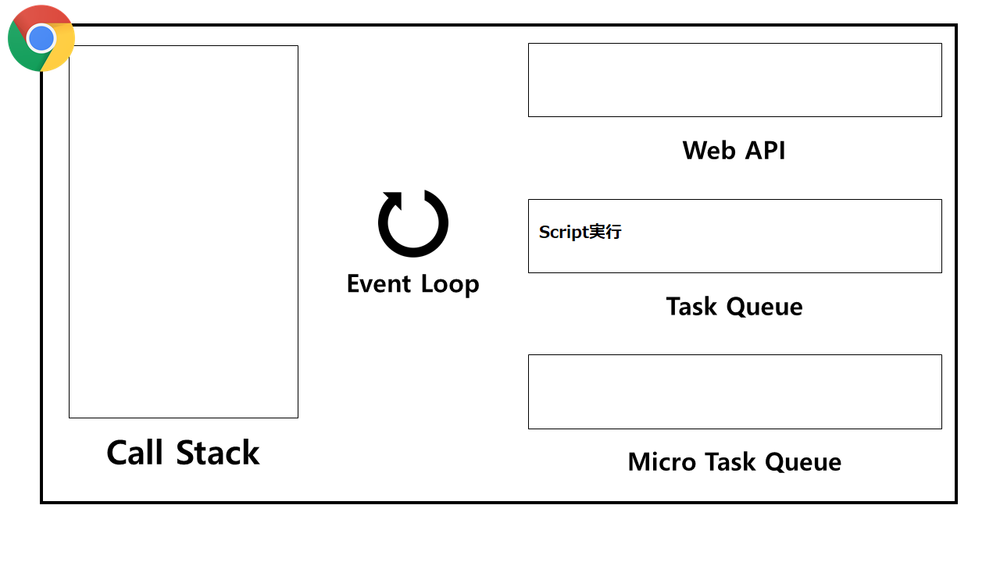
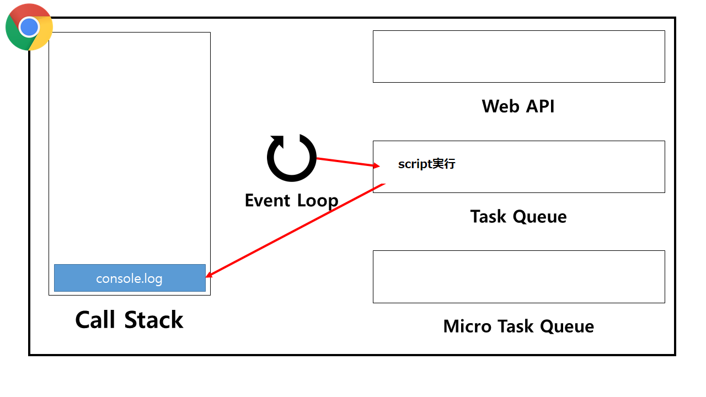
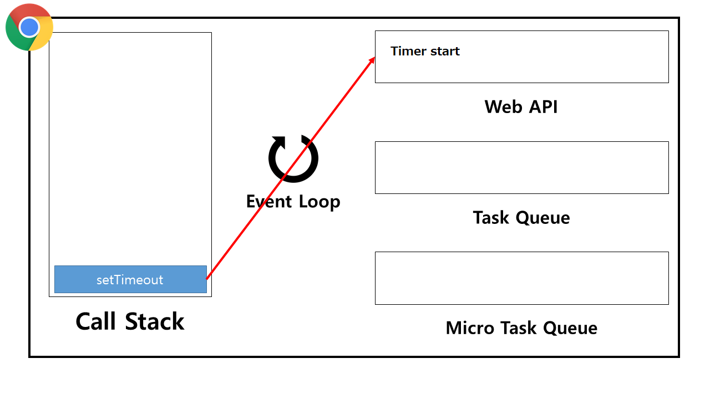
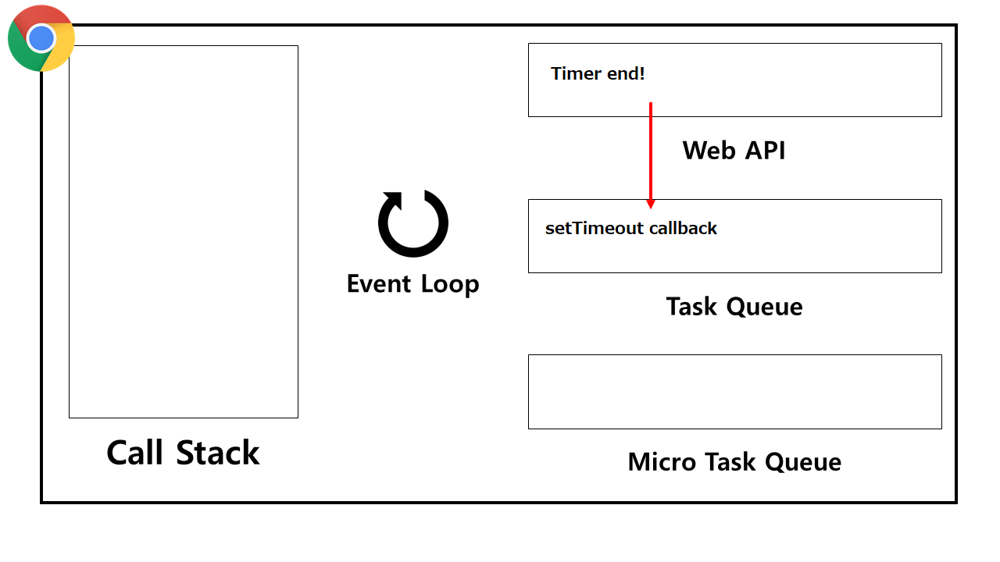
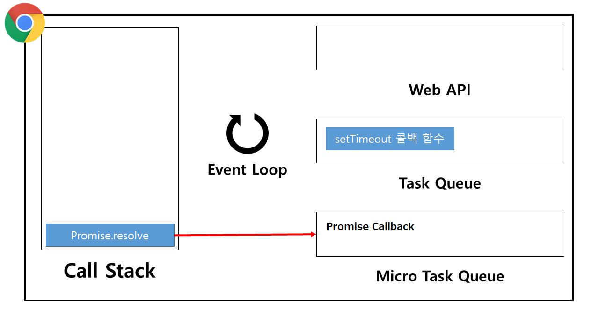
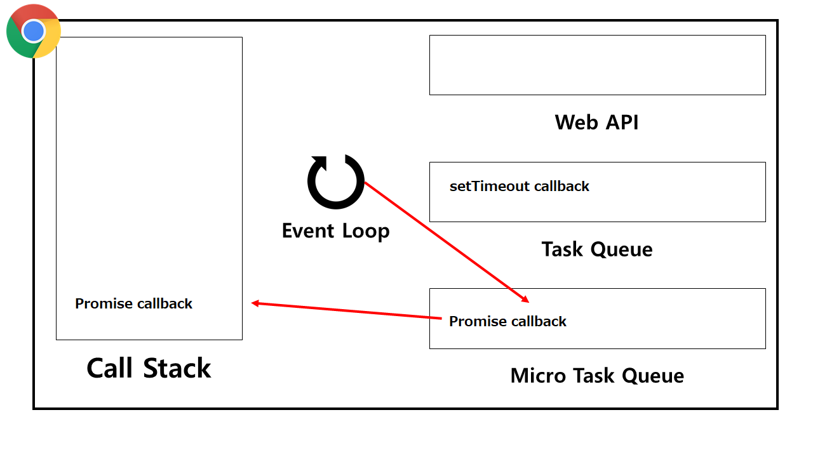
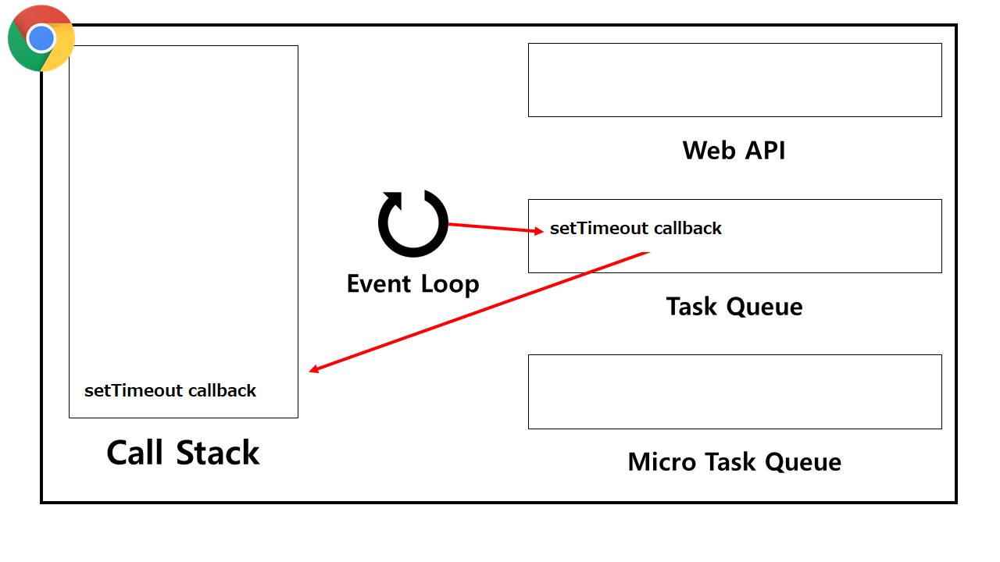

# イベントループ (Event loop)

Javascript は **Single-threaded 基盤 言語** であり、 Javascript Engine が単一の Call stack を持つ。これは Request が同期的に行われるとの意味でもある。
それでは非同期処理はどのように行われるのか。それは Javascript を実行する環境、Browser または Node.js が担当する。ここで**Javascript engine とその実行環境を相互連動させる装置がイベントループ**である。つまり、Event loop は Javascript engine ではなく Javascript が実行される環境に属する。

<br>

## Task queue と Microtask queue

Javascript 実行環境は 2 種類の Queue をもっている。これらは**Script 実行、Event handler, Callback function などのタスク(Task)が含まれる場所**である。タスクが Callback 関すであればその種類により別に Queue に持たれる。例としては下記のようにある。

-   **Task queue**
    -   `setTimeout()` , `setInterval()` , UI Rendering, `requestAnimationFrame()`
-   **Microtask queue**
    -   Promise, MutationObserver

イベントループは 2 個の Queue を監視していて、Callstack がからになると、Callback を持ち出し、実行する。ここで Microtask が Task より優先順位をもっている。
⚠ UI rendering が task の方においてある。つまり、Microtask が多い場合 Rendering が遅延される場合がある。

<br>

## 例

```javascript
console.log('Call stack')
setTimeout(() => console.log('task queue'), 0)
Promise.resolve().then(() => console.log('microtask queue'))
```

結果はかきのようになる。

```
Call stack
microtask queue
task queue
```

画像とともに説明をつづけると、最初 Script が Loading される時**スクリプト実行**というタスクが最初 Task queue にはいる。その後 Event loop が task queue から該当タスクを取り出す。その一方で Call stack には既に GEC(Global Execution Context)が生成されている状態であり、スクリプト実行のタスクが実行されるとその時に GEC のコードが実行される形になっている。



最初スクリプト実行が Task queue に入る。



以降、Event loop が task queue から該当タスクを取り出す。そして Callstack が実行される。



その後`setTimeout()`が call stack に行き、Browser はこれを確認しタイマーをかける。



タイマーが終わると `setTimeout()` の callback を Task に入れる。



次には`Promise` が Callstack に行き、Callback 関数を Microtask にいれる。



Event loop はまず Microtask から`Promise`の Callback を取り出し Callstack にいれる。



`Promise`の Callback が終わるとその後 Task から`setTimeout()`の Callback を取り出し Callstack に入れる。


`setTimeout()`の Callback が終わると Callstack はからになり、Heap も GC により削除される。（プログラム終了）

<br>

## Reference

-   [what the heck is the event loop anyway](https://www.youtube.com/watch?v=8aGhZQkoFbQ)
-   [Event loop: microtasks and macrotasks](https://javascript.info/event-loop)
