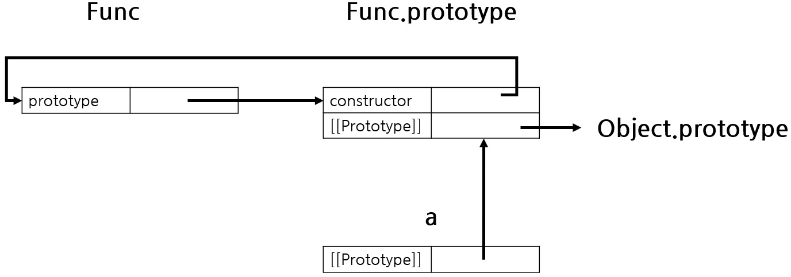

# プロトタイプ (Prototype)

Javascript の全ての Object は自分の **"原型"** となる Object を持ち、それを Prototype という。見えない Property の`[[Prototype]]`が自分の Prototype を参照している。これを`__proto__` という Property で参照することはできるが、これは非標準であり、全ブラウザーで動作することはないので実際使うのはさけるべきである。

```javascript
var student = {
    name: 'Lee',
    score: 90,
}

// studentには hasOwnProperty Methodはないがしたは動作する。
console.log(student.hasOwnProperty('name')) // true
```

<br>

## .prototype と [[Prototype]]

プロトタイプが紛らわしいのは`.prototype`と `[[Prototype]]`があるため。全 Object は隠れてる Property の`[[Prototype]]`を持っている。一方**関数 Object**は接近できる`prototype`Property をもっている。名前は一緒であるが、関係を明確にしておく必要がある。

-   `[[Prototype]]` : 自分のプロトタイプ Object を参照する隠れている Property
-   `.prototype` : `new` 演算子で関数を宣言する時、それにより作られた新しい Object の`[[Prototype]]`が参照するもの

```javascript
function Func() {}
var a = new Func()
```

`Func` を演算子で宣言して、それで新しい Object `a` が生成される。Prototype は下記のように構成される。



`constructor` とは全 `.prototype` Object の Property にあるもので実際の Object を参照している。
そして`Func.prototype` の `[[Prototype]]` が `Object.prototype`に繋がるが、これは全 Object の Prototype であり、最後にくる Prototype である。

整理すると下記のようになる。

-   `new` 演算子で新しい Object `a` を作る=>, `a`の Prototype object は `Func.prototype`。
-   `Func.prototype` は `constructor` をもっていて、これは実際の Object `Func` を参照している。
-   `Func.prototype` も Object であるため、`[[Prototype]]` を持ち、これを全 Object の Prototype である`Object.prototype` を参照している。

<br>

## Prototype chain

Object の Property を参照したり、値を入れる時**該当 Object に Property がない場合、その Object の Prototype を連鎖的にみながら Property を探す方式**。
参照する時と値を入れる時メカニズムが違う。

-   **Property を参照する時**
    1.  探している Property が Object に存在するなら使う。
    2.  存在しない場合、`[[Prototype]]` に乗って登っていきながら、Property を探す。
    3.  存在すると使うが、ない場合は undefined を Return。
-   **Property に値を入れる時**

    1.  探している Property が Object に存在するなら値を入れ変える。
    2.  存在しない場合、`[[Prototype]]` に乗って登っていきながら、Property を探す。

        -   Property が変更できる場合、 `writable: true` なら新しい Property として入れる。**上に同名の Property がある場合はこれにより見えなくなる。**
        -   Property が変更できない場合、`writable: false` なら Strict モードはエラー、以外は無視される。

下の場合 `a` は Prototype である`Func`を継承している。 `Func.prototype` に `num` が 2 であるが、 `a.num = 1` で上の同名の Property が見えなくなっている。

```javascript
function Func() {}
Func.prototype.num = 2
var a = new Func()
a.num = 1
console.log(a.num) // 1
```

`defineProperty()`を使い変更できない Property になると、Strict モード以外では`a.num = 1`は無視される。

```javascript
function Func() {}
Object.defineProperty(Func.prototype, 'num', {
    value: 2,
    writable: false,
})
var a = new Func()
a.num = 1 // 無視
console.log(a.num) // 2
```

上の例がピンと来ない場合は MDN の例題をおすすめ。

```javascript
// o というオブジェクトがあり、自身のプロパティとして a と b を持っています。
{a: 1, b: 2}
// o.[[Prototype]] は b と c プロパティを持っています。
{b: 3, c: 4}
// 最後に、o.[[Prototype]].[[Prototype]] は null です。
// これがプロトタイプチェーンの終端としての null であり、
// 定義によると、 null は [[Prototype]] を持っていません。
// つまり、プロトタイプチェーン全体は次のようになります。
{a:1, b:2} ---> {b:3, c:4} ---> null

console.log(o.a) // 1
// o には、自身のプロパティとして 'a' があるでしょうか？はい、その値は1です。

console.log(o.b) // 2
// o には、自身のプロパティとして 'b' があるでしょうか？はい、その値は2です。
// o のプロトタイプにも 'b' プロパティがありますが、アクセスされません。
// これを「property shadowing」と呼びます。

console.log(o.c) // 4
// o には、自身のプロパティとして 'c' があるでしょうか？いいえ、そのプロトタイプを確認します。
// o.[[Prototype]] には、自身のプロパティとして 'c' があるでしょうか？はい、その値は4です。

console.log(o.d) // undefined
// o には、自身のプロパティとして 'd' があるでしょうか？いいえ、そのプロトタイプを確認します。
// o.[[Prototype]] には、自身のプロパティとして 'd' があるでしょうか？いいえ、そのプロトタイプを確認します。
// o.[[Prototype]].[[Prototype]] は null であるため探索を中止し、
// プロパティが見つからなかったため undefined を返します。
```

<br>

## 関連 Method

### Object.create()

Object.create は新しい Object を作る。作られた新しい Object の Prototype はこの Method の最初の引数である。

```javascript
var a = { a: 1 }
// a ---> Object.prototype ---> null

var b = Object.create(a)
// b ---> a ---> Object.prototype ---> null
```

### getPrototypeOf, setPrototypeOf

Object の Prototype を Get,Set する Method。

```javascript
function A() {}
function B() {}
var a = new A()
console.log(Object.getPrototypeOf(a)) // A.prototype
Object.setPrototypeOf(a, B.prototype)
console.log(Object.getPrototypeOf(a)) // B.prototype
```

<br>

## Reference

-   [Stackoverflow, What's the difference between isPrototypeOf and instanceof in Javascript?](https://stackoverflow.com/questions/2464426/whats-the-difference-between-isprototypeof-and-instanceof-in-javascript)
