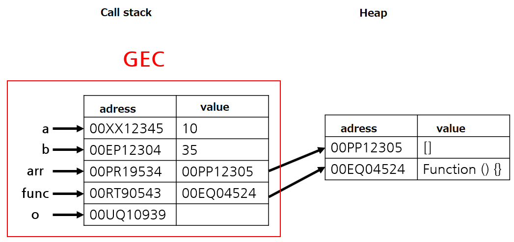
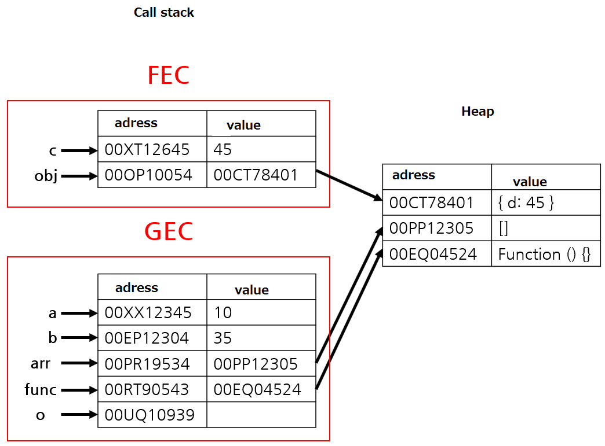
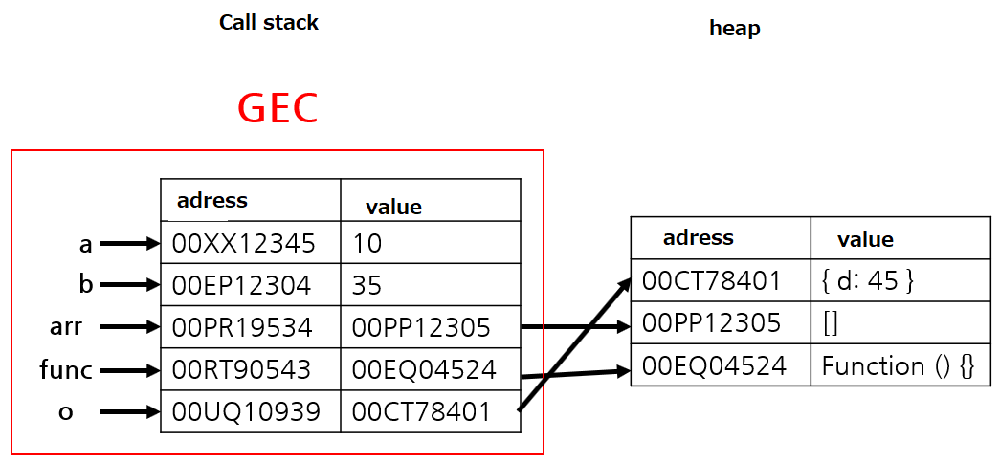

コールスタック(Call stack)とヒップ(Heap)

> ❌adress ✅address

Javascript Engine は Javascript を実行する時に Prototype および参照 Type を保存するメモリ構造としてコールスタック(Call stack)とヒップ(Heap)を持つ。

-   **Call stack** : **Prototype 値** と 関数呼び出しの **実行コンテキスト(Execution Context)** を保存するところ。
-   **Heap** : Object,配列、関数などサイズが **動的に変わることがある参照 Type の値**を保存するところ。

<br>

## 例

```javascript
let a = 10
let b = 35
let arr = []
function func() {
    const c = a + b
    const obj = { d: c }
    return obj
}
let o = func()
```

上の Code で Call stack と Heap の動作を確認すると下記のようである。

まず、GEC(Global Execution Context)が生成され、Prototype 値は Call stack、参照値は Heap に保存される。



その後、関数`func()`を実行し、新しい FEC(Function Execution Context)が生成され、また Prototype 値は Call stack、参照値は Heap に保存される。



以降、関数`func()`は Object`obj`を Return し、`o`が初期化される。FEC はその後 Call stack から削除される。



全 Code の実行が終わると GEC が Call stack から削除される。Heap を参照する Stack がないため、Garbage Collector(GC)により、Heap も削除される。

<br>

## Reference

-   [JavaScript V8 Engine Explained](https://hackernoon.com/javascript-v8-engine-explained-3f940148d4ef)
-   [V8 Memory usage(Stack & Heap)](https://speakerdeck.com/deepu105/v8-memory-usage-stack-and-heap?slide=9)
