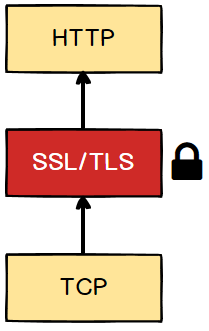

# HTTPS

HTTPS(HyperText Transfer Protocol over TLS/SSL)は **従来の HTTP を暗号化した Protocol**でセキュリティーが強化された Version である。略語での "S"は本来 SSL(Secure Socket Layer)であったが、 SSL 3.1 から TLS(Transport Layer Security)に変わった。TCP の連結の後、TLS を通して暗号化設定になり、通信することになる。

 

## 特徴

-   **Public Key と Private Key** : Public Key は誰もが見ることができるキーであり、Private key は所有者のみもっているキーで暗号化、復号化に使われる。
-   **Symmetric-key Cryptography** : Server と Client の暗号化、復号化に同一の Private キーを使う方式。キーを共有するのに問題があるが、速度が早い。
-   **ASymmetric-key Cryptography** : Server と Client が暗号化、復号化の時別々の Private キーを使う方式。Public キーを使って暗号化し、Private キーを使って復号化する。キーの管理に問題はないが、速度が遅い。
-   **Certificate Authority, CA** : Cleint が接続を Request した Server が意図した Server であるかどうかを確認してくれる企業のこと。Client は Server に Request するとき CA が発給した認証書を送る。Server は CA の Public キーで復号化し、成功した場合信頼する。

 

## 原理

HTTPS は **Symmetric-key Cryptography** を使う。

1. ブラウザ：SSL 通信をリクエストする
2. サーバー：SSL サーバー証明書を送付する
3. ブラウザ：受け取った証明書の公開鍵を使って共通鍵を暗号化し、サーバーに送付する
4. サーバー：受け取った共通鍵を、秘密鍵を使って復号する
5. ブラウザ/サーバー：一致した共通鍵を使って送受信するデータを暗号化、復号して暗号化通信を成立させる

 
