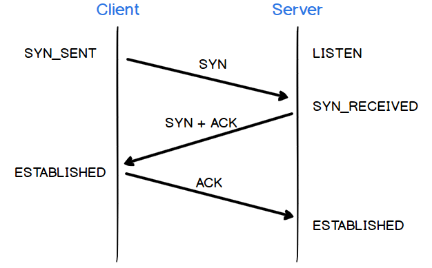

# TCP と UDP

OSI 7layer の中の Transport layer に属する Data Transfer Protocol である。深すぎないよう重要なポイントだけチェックする。

## TCP (Transmission Control Protocol)

Data の Transfer を必ず保障する Protocol であり、下記のような特徴を持つ。

1. **Connection-oriented**
   連結志向。2 個の Host が通信をする前に必ず繋がっている。

2. **Reliability** 、 **In-order delivery**
   信頼性、送信の順番を保つ。

3．**Flow control**
送信側の Data の量を調節する。

4．**Congestion control**
送信側のネットワーク状況を感知し、Data の量を調節する。

5. **Error detection**
   送信を損ねた場合再送信する。

6. **Full duplex**
   2 個の Host 全部送信、受信側になることができる。

7. **Byte stream**
   Data を連続した Byte としてみなし、Segment 単位の Packet にわけて送信する。

✅ HTTP, FTP, SMTP, TELNET などで使われている。

### 3-way handshaking

TCP が Host の間の連結を設定する方法で、SYN/ACK Packet を通して行われる。SYN は同期化(SYNchronize)Packet、ACK は確認(ACKnowledgement)Packet である。

1.  **LISTEN** : Server が Client の連結 Request を待っている。
2.  **SYN_SENT** : Client が Server に連結 Request を SYN packet に含めて送信する。
3.  **SYN_RECEIVED** : SYN Packet をうけた Server は SYN とともに ACK Packet を Client に送信する。
4.  **Client ESTABLISHED** : SYN+ACK Packet をうけた Client は SYN+ACK を確認し、正確に連結したことを確認する。そして Server に ACK を送信する。
5.  **Server ESTABLISHED** : Server も Client からうけた ACK を確認し、正確に連結したことを確認する。以降、本格的な通信が行える。

✅ 上の通信の間、Sequence number, Sequence number+1 などの理論が登場するが、躊躇なく省略。
 

## UDP (User Datagram Protocol)

TCP と違い、Data の信頼性を保証しない Protocol であり、下記のような特徴を持つ。

1.  **Connection-less**
    連結を設定し、解除する過程がない。

2.  **reverse-TCP**
    **Reliability** 、 **In-order delivery**、**Flow control**、**Congestion control**、**Error detection**のような TCP の特徴がない。信頼性がなく、Data の順番を保証しない。Error の完治は Header の Checksum くらいしかない。

3．**Datagram**
Packet の単位が Datagram であり、連続してないため、受信側は送信側の送ったサイズそのまま受信する。

4．**High speed**
TCP より作業量が低いため、速度が早い。

✅ DNS, DHCP, Video/Audio Streaming などで使われている。

 

## Reference

-   [RFC793, TCP Specification](https://tools.ietf.org/html/rfc793#section-3.4)
-   [Wikipedia, UDP](https://en.wikipedia.org/wiki/User_Datagram_Protocol)
-   [Difference between TCP and UDP?](https://stackoverflow.com/questions/5970383/difference-between-tcp-and-udp)
