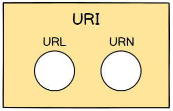

# URL と URN を含む URI

## URI(Uniform Resource Identifier)

Uniform Resource Identifier を略した URI は**ネット上の Resource**を固有に識別できる識別子である。URI には位置を教えてくれる**URL(Uniform Resource Locator)**と全世界で固有な名前を意味する**URN(Uniform Resource Name)**が存在する。

 

## URL(Uniform Resource Locator)

**該当位置からどのように Resource を取り出すのかに対して情報を持っている**

例えば次のような情報がある。

> 福岡県直方市山辺 123-12 山田ビルディング 101 号室

もし、この部屋に**私一人暮らし**であれば、上は私という Resource の唯一の識別子となる。ただ、もし他の人と一緒に住んでいるのであるとなると話は違う。これが URN の由来である。

 

## URN(Uniform Resource Name)

**Resource を唯一で永久な名前で識別するが、ネット上の位置は教えてくれない**

もし、地球上に'まつながしゅん'という名前が唯一であれば、URN の条件に相応しい。つまり、いつも変わる位置ではなく、**唯一な識別子の名前を基準にして**Resource を区分するとのことである。

 

## 例

- **URL**
  - http://example.com/mypage.html (Protocol): http)
  - ftp://example.com/download.zip (Protocol): ftp)
  - mailto:user@example.com (Protocol): mailto)
- **URN**
  - urn:isbn:0451450523 (本を識別する ISBN 番号)

 

## 참고

- [What is the difference between a URI, a URL and a URN?](https://stackoverflow.com/a/1984225/11789111)
